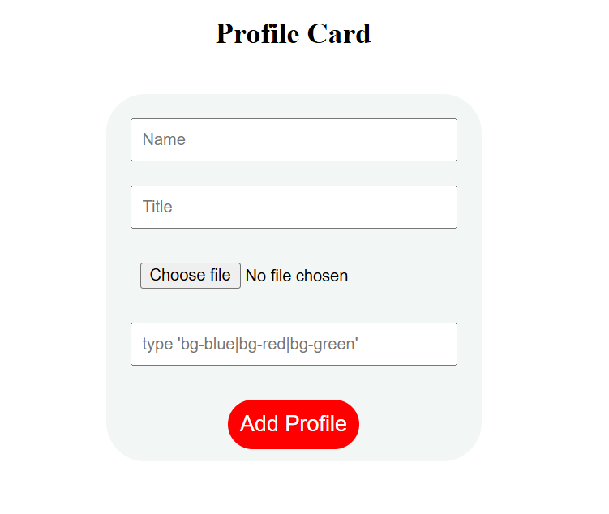
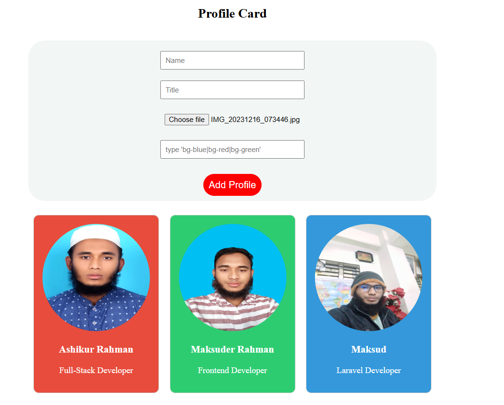

# This is a simple project using useState() hook and passing props of React.

# This app is fully responsive with grid.

# This is the screenshot of emty profile card.

# This screenshot is after adding three profile card.

